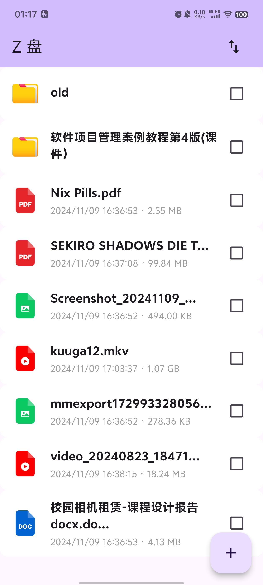
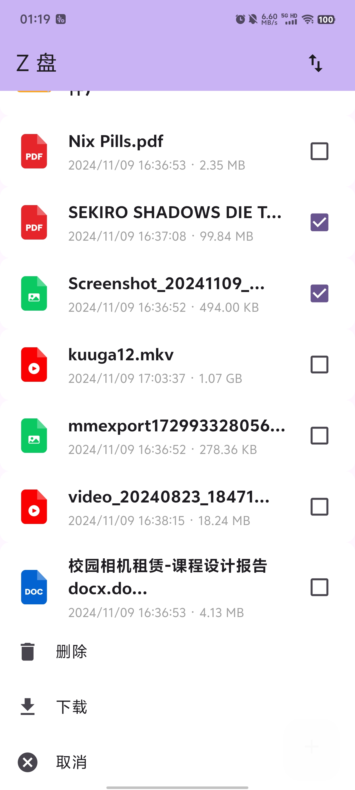
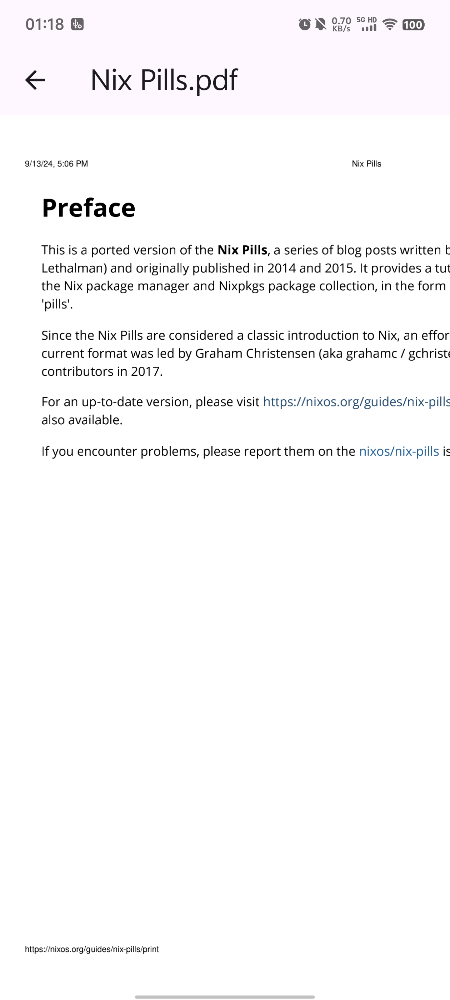
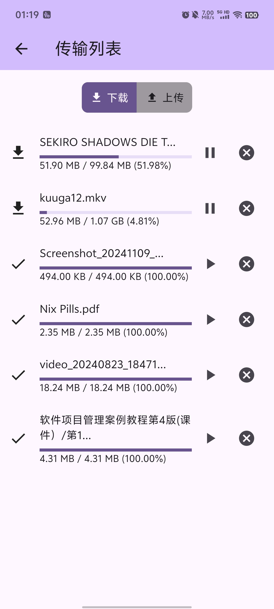

# 基于对象存储服务的文件管理APP

## 具体要求：
1. 编写APP访问MinIO对象存储服务中名为fultter-test的Bucket，并能对此Bucket内所存储
的文件进行查看、删除、上传和下载操作
2. 此APP需维护一个上传队列和一个下载队列，多文件上传或下载时需要进行排队处理，
每个队列最多支持3个同时进行的任务。
3. 此APP使用Flutter开发, 目标程序在Windows、Mac和Android，iOS系统中任意一个可运
行即可
4. 完成后提交完整可编译的工程源代码

## 已实现的功能
- [x] 文件列表查看(下拉刷新)
- [x] 文件预览(图片、音视频及pdf, 不保证所有格式都能播放) 
- [x] 文件删除 
- [x] 文件下载（不支持文件夹的下载）
- [x] 文件上传 

## 效果展示

    

        
    

    

        
    

    

        
    

    

        
    

    

        
    

    

        
    

## 改进计划
- 文件的展示方式（列表视图，图标视图）
- 文件的排序
- 一次显示一定数量的文件
- 退出保存下载和上传历史
- 选择保存路径

## 遇到的问题
- 在改变文件复选框的状态时，都要重新渲染，导致重新请求文件列表（解决方法：缓存请求数据）
- 路径

## 界面参考
- 阿里云盘
- 百度网盘
